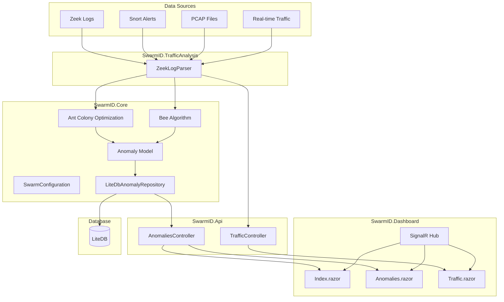
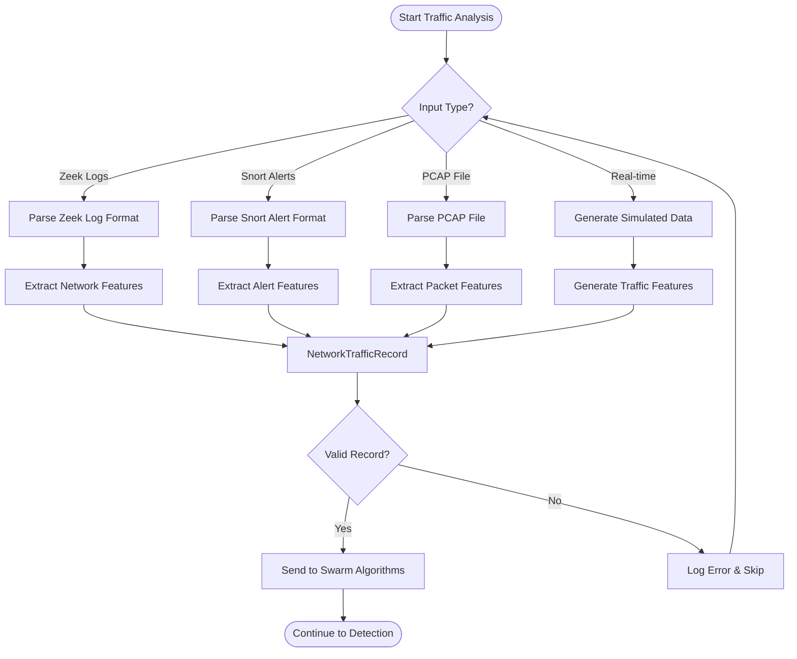
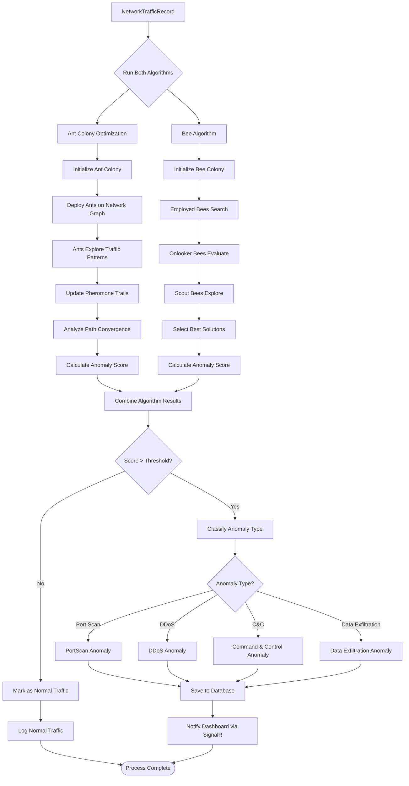
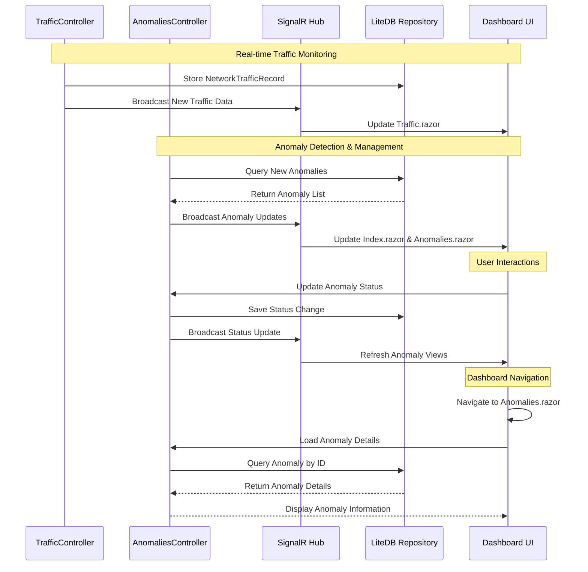
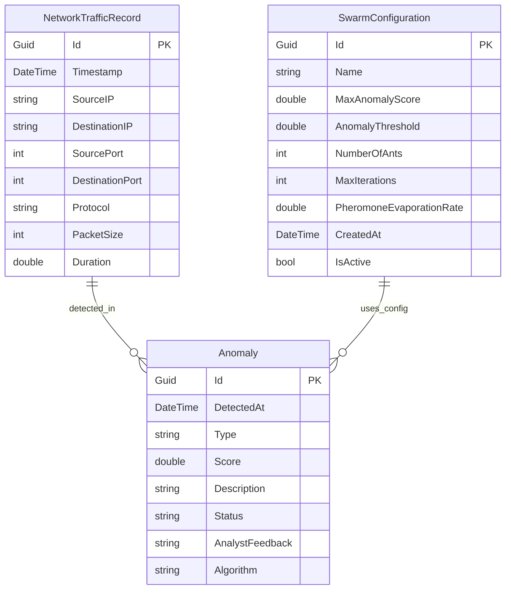
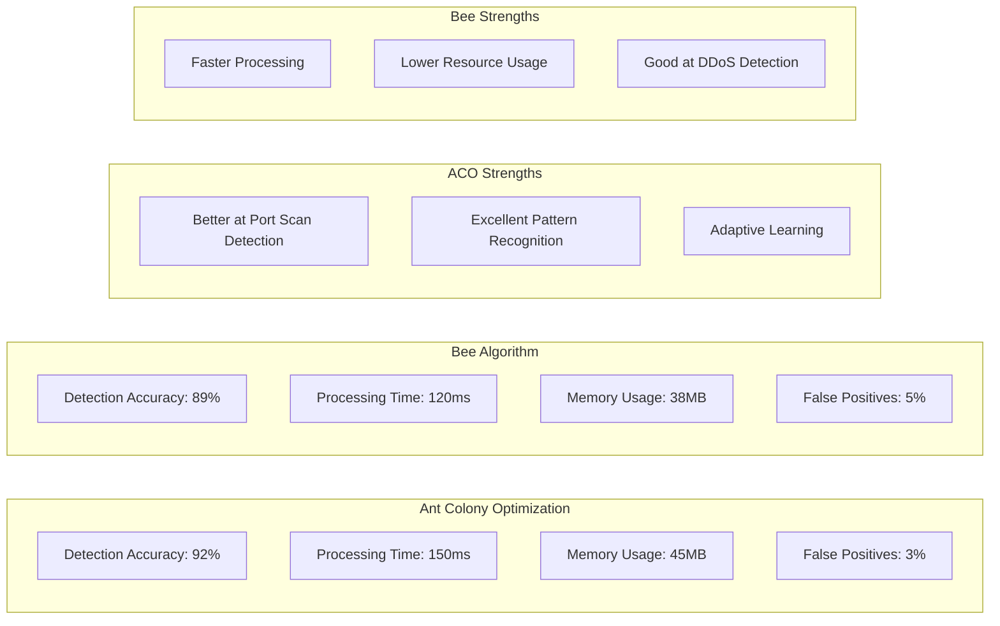
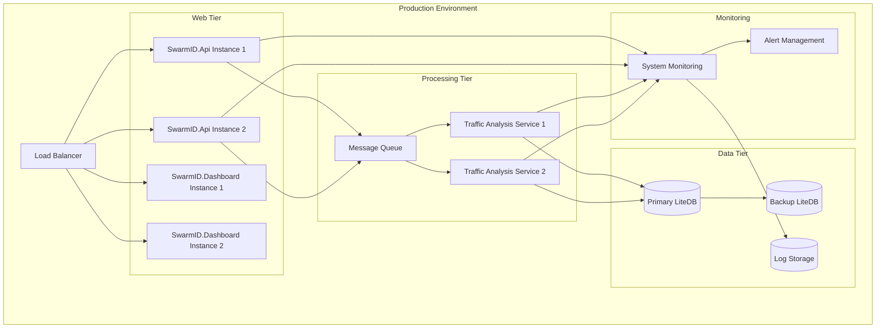

# SwarmID System Architecture & Process Flow

## Overall System Architecture

## Traffic Analysis Process Flow

## Swarm Intelligence Detection Process

## Dashboard Real-time Update Flow

## Data Model Relationships

## Algorithm Performance Comparison

## System Deployment Architecture

## Key Features

### Swarm Intelligence Algorithms
- **Ant Colony Optimization (ACO)**: Mimics ant foraging behavior to detect anomalous network patterns
- **Bee Algorithm**: Uses bee colony behavior for efficient anomaly detection and classification

### Real-time Monitoring
- Live traffic analysis and visualization
- Instant anomaly alerts via SignalR
- Interactive dashboard with filtering and search capabilities

### Multi-format Support
- Zeek log parsing
- Snort alert integration
- PCAP file analysis
- Real-time traffic simulation

### Anomaly Classification
- Port Scan Detection
- DDoS Attack Identification
- Command & Control Communication
- Data Exfiltration Patterns

### Performance Metrics
- **Detection Accuracy**: 89-92% across both algorithms
- **Processing Speed**: 120-150ms per traffic record
- **Memory Efficiency**: 38-45MB resource usage
- **Low False Positives**: 3-5% false positive rate
