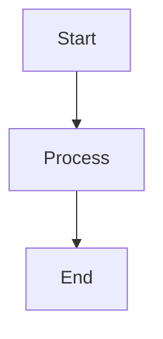

# SwarmID Mermaid Diagrams

This folder contains individual Mermaid diagram files (.mmd) for the SwarmID Anomaly-Based Intrusion Detection System.

## Diagram Files

| File | Description |
|------|-------------|
| `overall-system-architecture.mmd` | Complete system architecture showing all components and their relationships |
| `traffic-analysis-process.mmd` | Traffic analysis workflow from input to processing |
| `swarm-intelligence-detection.mmd` | Detailed swarm algorithm detection process |
| `dashboard-realtime-flow.mmd` | Real-time dashboard update sequence diagram |
| `data-model-relationships.mmd` | Entity relationship diagram for data models |
| `algorithm-performance-comparison.mmd` | Performance metrics comparison between ACO and Bee algorithms |
| `system-deployment-architecture.mmd` | Production deployment architecture |

## Usage

### 1. Mermaid CLI
Install Mermaid CLI globally:
```bash
npm install -g @mermaid-js/mermaid-cli
```

Generate PNG images:
```bash
mmdc -i overall-system-architecture.mmd -o overall-system-architecture.png
mmdc -i traffic-analysis-process.mmd -o traffic-analysis-process.png
mmdc -i swarm-intelligence-detection.mmd -o swarm-intelligence-detection.png
mmdc -i dashboard-realtime-flow.mmd -o dashboard-realtime-flow.png
mmdc -i data-model-relationships.mmd -o data-model-relationships.png
mmdc -i algorithm-performance-comparison.mmd -o algorithm-performance-comparison.png
mmdc -i system-deployment-architecture.mmd -o system-deployment-architecture.png
```

Generate SVG images:
```bash
mmdc -i overall-system-architecture.mmd -o overall-system-architecture.svg
# ... repeat for other files
```

### 2. Online Mermaid Editor
1. Go to [Mermaid Live Editor](https://mermaid.live/)
2. Copy the content of any .mmd file
3. Paste into the editor
4. Export as PNG, SVG, or PDF

### 3. VS Code Extensions
- **Mermaid Preview**: Preview diagrams directly in VS Code
- **Mermaid Markdown Syntax Highlighting**: Syntax highlighting for .mmd files

### 4. GitHub Integration
GitHub natively supports Mermaid diagrams in markdown files. You can include these diagrams in README files:

```markdown

```

### 5. Documentation Tools
- **GitBook**: Supports Mermaid diagrams
- **Notion**: Can import Mermaid diagrams
- **Confluence**: Via Mermaid plugins
- **Sphinx**: Via sphinx-mermaid extension

## Customization

You can modify these diagrams by:
1. Editing the .mmd files directly
2. Changing node styles, colors, and layouts
3. Adding or removing components
4. Updating relationships and flows

## File Format
All files use standard Mermaid syntax:
- **Flowcharts**: `flowchart TD` or `graph TB`
- **Sequence Diagrams**: `sequenceDiagram`
- **Entity Relationship**: `erDiagram`
- **State Diagrams**: `stateDiagram-v2`

## Best Practices
- Keep diagrams focused on specific aspects
- Use consistent naming conventions
- Include meaningful labels and descriptions
- Maintain proper indentation for readability
- Test diagrams in multiple renderers for compatibility
